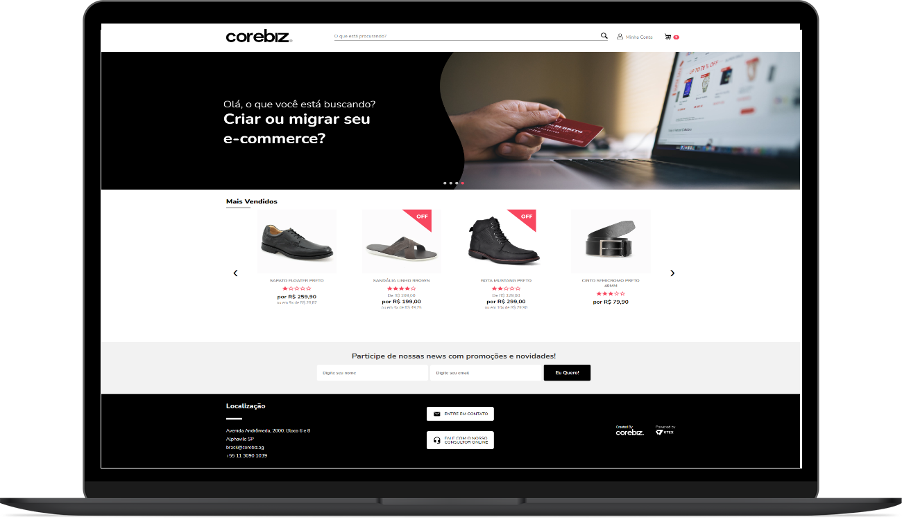

<div align="center">
    <h1 align=center>
    <a href="https://www.corebiz.ag/en/">
       <span>Store<span>
     </a>
  </h1>
</div>

<div align="center">
  <h1 align=center> 
    <a href="https://www.typescriptlang.org/">
      
    </a>
    <a href="https://pt-br.reactjs.org/docs/getting-started.html">
      
    </a>
    <a href="https://github.com/styled-components">
      
    </a>
    <a href="https://code.visualstudio.com/">
      
    </a>
  </h1>
</div> 

<div align="center">
  <h1 align=center> 
    
    
 </h1></div>


<p align="center">
  <a href="#spades-projeto">Sobre o Projeto</a>&nbsp;&nbsp;&nbsp;|&nbsp;&nbsp;&nbsp;
  <a href="#clubs-tecnologias">Tecnologias</a>&nbsp;&nbsp;&nbsp;|&nbsp;&nbsp;&nbsp;
  <a href="#clubs-baixando-o-projeto">Baixando o Projeto</a>&nbsp;&nbsp;&nbsp;|&nbsp;&nbsp;&nbsp;
  <a href="#black_nib-observações">Observações</a>&nbsp;&nbsp;&nbsp;|&nbsp;&nbsp;&nbsp;
</p>

Esta _Landing Page_ teve como objetivo a construção da _Home_ de um site de _E-commerce_,
Mostrando adição em tempo real de produtos ao carrinho. Além de estar seguindo um dos melhores
para _Sites_ do ramo. 

# :spades: Projeto:
  O **Corebiz Store** tem como objetivo testar a capacidade técnica do desenvolvedor, nos pontos mais cruciais voltados ao ramo de _Front-end_, abordando os pontos de consumir dados de uma API, trabalhar com responsividade, adaptando assim o site para maior parte dos dispositivos móveis. Além, é claro, de avaliar a construção do código, boas práticas, conhecimentos avançados, dentre outros.
 
## :clubs: Tecnologias
 <summary> <b> = () &rarr; : </b> </summary>
  
  #### :computer: Dependencies JSON: <i><kbd> [package.json](./package.json) </kbd></i>
  
- [x] <b>Axios:</b> <i>Usado para o tratamento do consumo dos serviços da API </i>
- [x] <b>Styled-Components:</b> <i>Como maior recurso de estilização utilizado (há presença de SASS e CSS)</i>
- [x] <b>Swiper:</b> <i>Para construção de Slides</i>
- [x] <b>React Elastic Carousel:</b> <i>Para construção de Slides das Shelfs</i>
- [x] <b>Typescript:</b> <i>Como Superset para Javascript</i>
- [x] <b>Context e Hooks:</b> <i>Para manipulação dos valores do Minicart</i>

## :clubs: Baixando o Projeto

1. É nessário possuir o **Node.js** instalado na máquina
  2. Assim como o **GIT** para a clonagem do repositório
 
 Após checagem dos itens anteriores basta apenas realizar os seguintes comandos:
  ```sh
    git clone link_do_repo
    cd corebiz-store
  ```
  ```sh
    npm install
    or
    yarn install
  ```
  ```sh
    E Por fim, para rodar o projeto em seu http://localhost:3000/ basta apenas:
    yarn install
  ````
## :black_nib: Observações
Algumas notas sobre os requisitos do projetose afins:
- [x] O Layout Mobile foi considerado apenas para aparelhos de 320px de largura (No caso semelhantes ao iphone)
- [x] O menu mobile não foi citado para o layout, apenas seu ícone de inicialização.
- [x] Ícone de minha conta mobile não está presente, possívelmente dentro do menu.
- [x] Funções presentes: Apenas de adicionar ao carrinho e envio de _Newsletter_, os demais elementos são estáticos
- [x] Rotas Utilizadas: [GET](https://corebiz-test.herokuapp.com/api/v1/products) para produtos E [POST](https://corebiz-test.herokuapp.com/api/v1/newsletter) para envio de Newsletter.

<h3 align="center"> :checkered_flag: Made by: <a href="https://www.linkedin.com/in/gama-leal" /> Moacir Gama </a> :checkered_flag: </h3>
